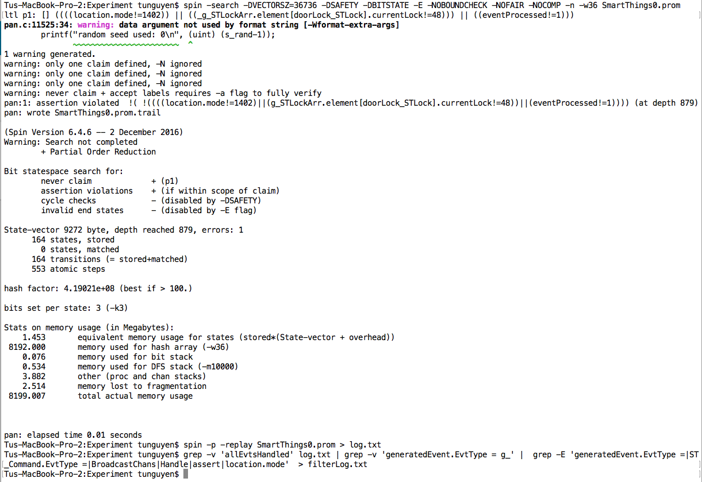

# Overview

In this repository you will find the detailed technical report and protype code of IoTSan, a model-checking-based tool used to verify the safety of IoT systems.

This work was accepted and will be published at *The 14th International Conference on emerging Networking EXperiments and Technologies (CoNEXT '18)*.

# Code Structure

IoTSan is developed based on [Bandera](http://bandera.projects.cs.ksu.edu/) and its code structure is as following:
1. The "*App Dependency Analyzer*" module and "*Translator*" (Groovy to Java) module are at "IoTSan/src/edu/ksu/cis/bandera/jjjc/gparser/"
2. The "*Model Generator*" module is at "IoTSan/src/edu/ksu/cis/bandera/spin/"
3. The "*Configuration Extractor*" module is at "IoTSan/src/configextractor" (This module is not yet integrated into IoTSan at this initial version).

This is the initial version of IoTSan, which does not include all of the modules mentioned in the paper. I will update this repository with additional modules.

# Using The Tool

1. Create an Eclipse project and clone this repository (you can find the instructions [here](https://github.com/collab-uniba/socialcde4eclipse/wiki/How-to-import-a-GitHub-project-into-Eclipse)).

2. Create the folder "input/smartapps" at the root directory of your porject. You then need to put the source code of apps and their configuration files in this folder. Note that you should give good names to app files since they will become the names of apps in the resulting modeled system.

3. Run the "IotSan.java" as "Java Application". The resulting Promela model code will be generated and stored at ".../IoTSan/output/IotSanOutput/birc".

4. Append the safety property in LTL format to the end of each output file.

5. Run the verification with SPIN using the following command in a terminal: 
`spin -search -DVECTORSZ=36736 -DSAFETY -DBITSTATE -E -NOBOUNDCHECK -NOFAIR -NOCOMP -n -w36 <Promela file>`. 
For example: 
`spin -search -DVECTORSZ=36736 -DSAFETY -DBITSTATE -E -NOBOUNDCHECK -NOFAIR -NOCOMP -n -w36 SmartThing0.prom`

6. If any violation is detected, the file "SmartThing0.prom.trail" will be created by SPIN. Use the following command to get counter-example log: `spin -p -replay SmartThings0.prom > log.txt`

7. Get a filtered logs by using: 
`grep -v 'allEvtsHandled' log.txt | grep -v 'generatedEvent.EvtType = g_' |  grep -E 'generatedEvent.EvtType =|ST_Command.EvtType =|BroadcastChans|Handle|assert|location.mode'  > filterLog.txt`

Note that you need to install SPIN by following instructions [here](http://spinroot.com/spin/whatispin.html) before using this tool.

# Samples

Please refer to the directory "*IoTSan/samples/*" for examples of app source code, config files, and log files.

Here is the snapshot of a verification run:

Filtered violation (**The main door is unlocked when people are sleeping at night**) log:

`ltl p1: [] ((((location.mode!=1402)) || ((_g_STLockArr.element[doorLock_STLock].currentLock!=48))) || ((eventProcessed!=1)))
  2:	proc  0 (:init::1) SmartThings0.prom:3707 (state 2)	[location.mode = 1400]
  2:	proc  0 (:init::1) SmartThings0.prom:3708 (state 3)	[location.modes.length = 3]
  2:	proc  0 (:init::1) SmartThings0.prom:3709 (state 4)	[location.modes.element[0].name = 1400]
  2:	proc  0 (:init::1) SmartThings0.prom:3710 (state 5)	[location.modes.element[0].isAlive = 1]
  2:	proc  0 (:init::1) SmartThings0.prom:3711 (state 6)	[location.modes.element[1].name = 1401]
  2:	proc  0 (:init::1) SmartThings0.prom:3712 (state 7)	[location.modes.element[1].isAlive = 1]
  2:	proc  0 (:init::1) SmartThings0.prom:3713 (state 8)	[location.modes.element[2].name = 1402]
  2:	proc  0 (:init::1) SmartThings0.prom:3714 (state 9)	[location.modes.element[2].isAlive = 1]
341:	proc  1 (SmartThings:1) SmartThings0.prom:3999 (state 82)	[generatedEvent.EvtType = sunriseTime]
347:	proc  1 (SmartThings:1) SmartThings0.prom:3656 (state 85)	[HandleLocationEvt_mode = 0]
349:	proc  1 (SmartThings:1) SmartThings0.prom:3691 (state 195)	[location.BroadcastChans[index0] = 1]
349:	proc  1 (SmartThings:1) SmartThings0.prom:3691 (state 195)	[location.BroadcastChans[index0] = 1]
357:	proc  1 (SmartThings:1) SmartThings0.prom:4064 (state 452)	[((location.BroadcastChans[UnlockDoor_location]==1))]
359:	proc  1 (SmartThings:1) SmartThings0.prom:4067 (state 454)	[location.BroadcastChans[UnlockDoor_location] = 0]
384:	proc  1 (SmartThings:1) SmartThings0.prom:4217 (state 7657)	[((location.BroadcastChans[GoodNight_location]==1))]
386:	proc  1 (SmartThings:1) SmartThings0.prom:4220 (state 7659)	[location.BroadcastChans[GoodNight_location] = 0]
467:	proc  1 (SmartThings:1) SmartThings0.prom:4032 (state 346)	[generatedEvent.EvtType = inactive]
469:	proc  1 (SmartThings:1) SmartThings0.prom:3915 (state 383)	[g_STMotionSensorArr.element[STMotionSensorIndex].BroadcastChans[index3] = 1]
469:	proc  1 (SmartThings:1) SmartThings0.prom:3915 (state 383)	[g_STMotionSensorArr.element[STMotionSensorIndex].BroadcastChans[index3] = 1]
483:	proc  1 (SmartThings:1) SmartThings0.prom:4111 (state 2239)	[((g_STMotionSensorArr.element[GoodNight_motionSensors.element[1].gArrIndex].BroadcastChans[GoodNight_motionSensors.element[1].BroadcastChanIndex]==1))]
485:	proc  1 (SmartThings:1) SmartThings0.prom:4114 (state 2241)	[g_STMotionSensorArr.element[GoodNight_motionSensors.element[1].gArrIndex].BroadcastChans[GoodNight_motionSensors.element[1].BroadcastChanIndex] = 0]
499:	proc  1 (SmartThings:1) SmartThings0.prom:2556 (state 2610)	[(!((location.mode==GoodNight_newMode)))]
521:	proc  1 (SmartThings:1) SmartThings0.prom:2677 (state 2700)	[(!((location.mode==GoodNight_newMode)))]
664:	proc  1 (SmartThings:1) SmartThings0.prom:3020 (state 3257)	[ST_Command.EvtType = Night]
664:	proc  1 (SmartThings:1) SmartThings0.prom:3596 (state 3203)	[HandleLocationEvt_mode = 1402]
664:	proc  1 (SmartThings:1) SmartThings0.prom:3678 (state 3225)	[location.mode = HandleLocationEvt_mode]
664:	proc  1 (SmartThings:1) SmartThings0.prom:3680 (state 3227)	[ST_Command.value = HandleLocationEvt_mode]
664:	proc  1 (SmartThings:1) SmartThings0.prom:3691 (state 3248)	[location.BroadcastChans[index0] = 1]
664:	proc  1 (SmartThings:1) SmartThings0.prom:3691 (state 3248)	[location.BroadcastChans[index0] = 1]
686:	proc  1 (SmartThings:1) SmartThings0.prom:4217 (state 7657)	[((location.BroadcastChans[GoodNight_location]==1))]
688:	proc  1 (SmartThings:1) SmartThings0.prom:4220 (state 7659)	[location.BroadcastChans[GoodNight_location] = 0]
702:	proc  1 (SmartThings:1) SmartThings0.prom:4266 (state 8334)	[((g_STMotionSensorArr.element[LightFollowsMe_motion1.gArrIndex].BroadcastChans[LightFollowsMe_motion1.BroadcastChanIndex]==1))]
704:	proc  1 (SmartThings:1) SmartThings0.prom:4269 (state 8336)	[g_STMotionSensorArr.element[LightFollowsMe_motion1.gArrIndex].BroadcastChans[LightFollowsMe_motion1.BroadcastChanIndex] = 0]
729:	proc  1 (SmartThings:1) SmartThings0.prom:3420 (state 8767)	[ST_Command.EvtType = off]
729:	proc  1 (SmartThings:1) SmartThings0.prom:3825 (state 8769)	[HandleSTSwitchEvt_state = 0]
729:	proc  1 (SmartThings:1) SmartThings0.prom:3577 (state 8810)	[HandleSTSwitchEvt_state = 16]
729:	proc  1 (SmartThings:1) SmartThings0.prom:3856 (state 8870)	[g_STSwitchArr.element[m10_4_m12_5_JJJCTEMP_0.gArrIndex].currentSwitch = HandleSTSwitchEvt_state]
729:	proc  1 (SmartThings:1) SmartThings0.prom:3857 (state 8871)	[g_STSwitchArr.element[m10_4_m12_5_JJJCTEMP_0.gArrIndex].switchState.value = HandleSTSwitchEvt_state]
729:	proc  1 (SmartThings:1) SmartThings0.prom:3867 (state 8881)	[ST_Command.value = HandleSTSwitchEvt_state]
729:	proc  1 (SmartThings:1) SmartThings0.prom:3877 (state 8898)	[g_STSwitchArr.element[m10_4_m12_5_JJJCTEMP_0.gArrIndex].BroadcastChans[index2] = 1]
754:	proc  1 (SmartThings:1) SmartThings0.prom:4064 (state 452)	[((location.BroadcastChans[UnlockDoor_location]==1))]
756:	proc  1 (SmartThings:1) SmartThings0.prom:4067 (state 454)	[location.BroadcastChans[UnlockDoor_location] = 0]
769:	proc  1 (SmartThings:1) SmartThings0.prom:3530 (state 648)	[ST_Command.EvtType = unlock]
769:	proc  1 (SmartThings:1) SmartThings0.prom:3754 (state 650)	[HandleSTLockEvt_state = 0]
769:	proc  1 (SmartThings:1) SmartThings0.prom:3588 (state 719)	[HandleSTLockEvt_state = 48]
769:	proc  1 (SmartThings:1) SmartThings0.prom:3791 (state 757)	[g_STLockArr.element[m13_7_JJJCTEMP_0.gArrIndex].currentLock = HandleSTLockEvt_state]
769:	proc  1 (SmartThings:1) SmartThings0.prom:3792 (state 758)	[g_STLockArr.element[m13_7_JJJCTEMP_0.gArrIndex].lockState.value = HandleSTLockEvt_state]
769:	proc  1 (SmartThings:1) SmartThings0.prom:3802 (state 768)	[ST_Command.value = HandleSTLockEvt_state]
789:	proc  1 (SmartThings:1) SmartThings0.prom:4165 (state 5085)	[((g_STSwitchArr.element[GoodNight_switches.element[0].gArrIndex].BroadcastChans[GoodNight_switches.element[0].BroadcastChanIndex]==1))]
791:	proc  1 (SmartThings:1) SmartThings0.prom:4168 (state 5087)	[g_STSwitchArr.element[GoodNight_switches.element[0].gArrIndex].BroadcastChans[GoodNight_switches.element[0].BroadcastChanIndex] = 0]
801:	proc  1 (SmartThings:1) SmartThings0.prom:1946 (state 5431)	[((location.mode==GoodNight_newMode))]
spin: _spin_nvr.tmp:3, Error: assertion violated
spin: text of failed assertion: assert(!(!((((location.mode!=1402)||(g_STLockArr.element[doorLock_STLock].currentLock!=48))||(eventProcessed!=1)))))
Never claim moves to line 3	[assert(!(!((((location.mode!=1402)||(g_STLockArr.element[doorLock_STLock].currentLock!=48))||(eventProcessed!=1)))))]`

# Citation
If you use the source code, please cite the following paper:

Dang Tu Nguyen, Chengyu Song, Zhiyun Qian, Srikanth V. Krishnamurthy, Edward J. M. Colbert, and Patrick McDaniel, "*IotSan: Fortifying the Safety of IoT Systems*," In Proc. of the 14th International Conference on emerging Networking EXperiments and Technologies (CoNEXT '18)
